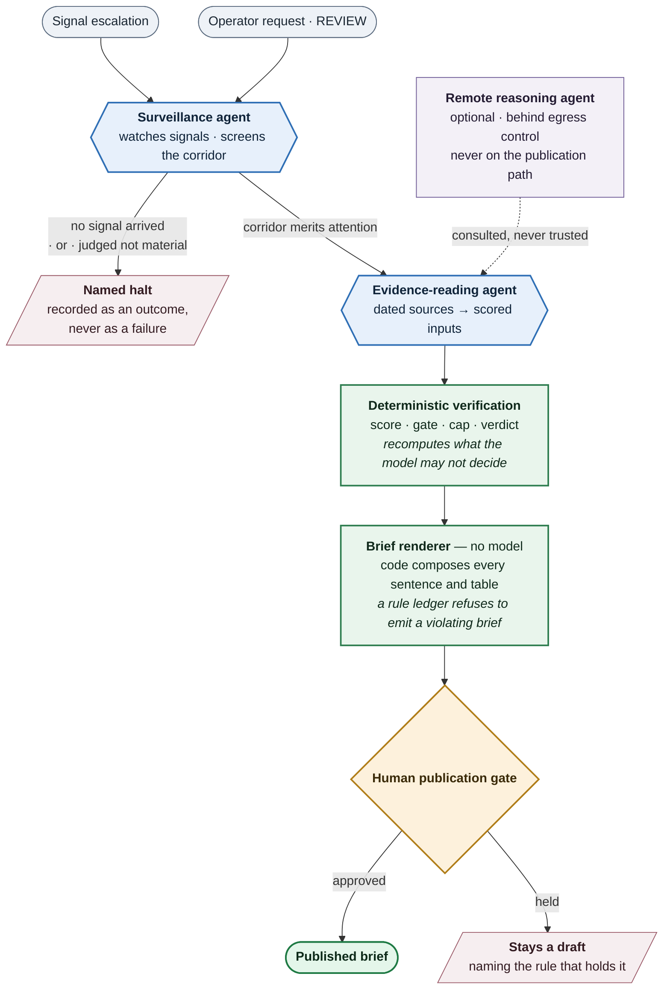

# Architecture

CaribFlow is a governed multi-agent system for trade-corridor prioritization.

The point of the system is not to generate a fluent answer. The point is to turn fragmented
signals into a decision-ready brief whose claims are traceable, bounded, and reviewable.

## System in one sentence

Multiple agents collect and judge evidence, a deterministic engine computes the verdict, and a
human gate decides what may be published.

## High-level flow

**How to read it.** Blue is a model making a judgement. Green is code that decides. Amber is the
one place a person must act. The two exits on the right are outcomes in their own right: a halt and
a held draft are results the ledger records, not failures it hides.

## Agents and contracts

### Surveillance agent

One agent covers both watching and screening. It is the entry point of every cycle.

- watches monitored signals and escalates when a relevant change appears
- decides whether a corridor should move forward, and can halt the cycle here
- distinguishes "no signal arrived" from "signal judged not material" — only the second is a
  judgement, and the run ledger keeps them apart
- records halts as a meaningful outcome, not a failure

### Evidence-reading agent

- reads archived sources
- converts source material into structured scoring inputs
- does not decide the final score on its own

### Brief renderer

- produces the brief body in deterministic code, not through a model
- composes every sentence and table from the stored record
- passes a rule ledger that refuses to emit a brief violating any of its entries

### Remote reasoning agent

- is optional and constrained
- operates behind controlled egress
- is treated as a support surface, not the public path

## Orchestrator guarantees

- single-flight execution by lease
- three attempts maximum per step
- named halt reasons
- separate traces for signal-triggered and review-triggered runs
- every important outcome is logged

## Deterministic verification layer

The deterministic layer is the core technical claim.

It recomputes what the model is not allowed to decide:

- the score
- the gate outcome
- the cap
- the final verdict
- the publication eligibility checks

That separation matters because the model is used for judgment, but the code is used for truth.

## Human gate

Publication is not automatic.

The human gate exists for release control:

- a brief may be drafted automatically
- a brief may be reviewed automatically
- a brief is only published after a human approval step

That is intentional. The system is not trying to replace institutional accountability.

## Why this is agentic

This is agentic because the work is divided into distinct roles with different responsibilities,
different stopping conditions, and a visible handoff between them.

It is not agentic because it chats.
It is agentic because it delegates, verifies, and refuses when the evidence is not enough.

## Why it fits the buildathon

The buildathon asks for something more serious than a chatbot demo.

This project is relevant because it shows:

- a multi-agent workflow
- a deterministic verification boundary
- traceable evidence use
- human-in-the-loop publication
- concrete value in trade and logistics

That combination is the technical premise, not an afterthought.
